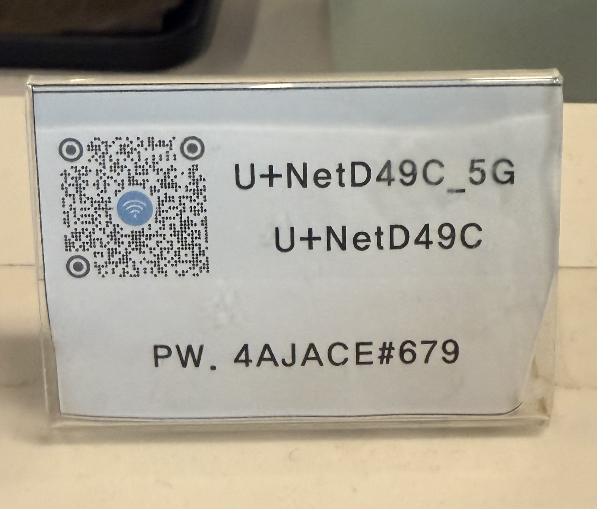
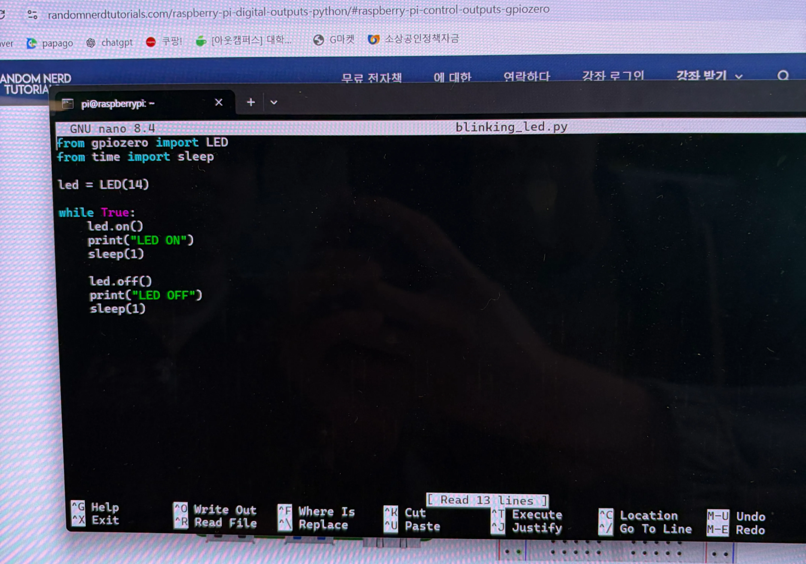

# Raspberry Pi SSH & LED Project

## 📅 5월 6일 16:00 ~ 18:00

### 1. Raspberry Pi OS 설치

SD 카드에 Raspberry Pi OS 설치 후 아래와 같이 설정하였다.

- Username: `iot`
- Hostname: `임현준의 iPhone`
- Password: `abcd1234`

---

### 2. SSH 연결 시도

→ 실패

#### 실패 원인

- 핫스팟 신호가 약해 네트워크가 불안정했음
- PuTTY 사용 중 호환 오류 발생

#### 해결 방향

- 다음날 개인 카페의 보안 네트워크를 사용하여 다시 시도하기로 함

---

# 📅 5월 7일 13:00 ~ 16:00

## 1. Raspberry Pi OS 재설치

- Username: `pi`
- Hostname: `raspberrypi`
- Password: `김민준`

---

## 2. SSH 연결 시도

### (1) boot 폴더에 `ssh` 파일 생성

### (2) boot 폴더에 `wpa_supplicant.conf` 파일 생성

다음 코드를 작성하였다.

```conf
ctrl_interface=DIR=/var/run/wpa_supplicant GROUP=netdev
update_config=1
country=KR

network={
    ssid="U+NetD49C_5G"
    psk="4AJACE#679"
    key_mgmt=WPA-PSK
}
```

→ SSH 연결 성공

---

### 📷 처음 SSH 접속에 성공한 모습


---

### 🎞️ SSH 접속 성공 GIF


---

### 📷 개인 카페 보안 네트워크



---

# 💡 Control Raspberry Pi Digital Outputs with Python (LED)

## 1. 회로 조립

- 참고 사이트를 보고 LED 회로를 동일하게 구성하였다.

---

## 2. Python 파일 생성

```bash
nano blinking_led.py
```

---

## 3. 코드 작성

```python
from gpiozero import LED
from time import sleep

led = LED(14)

while True:
    led.on()
    print("LED ON")
    sleep(1)

    led.off()
    print("LED OFF")
    sleep(1)
```

---

### 📷 nano 편집기에서 저장한 모습



---

## 4. 실행

```bash
python3 blinking_led.py
```

---

### 🎞️ LED 실행 GIF


